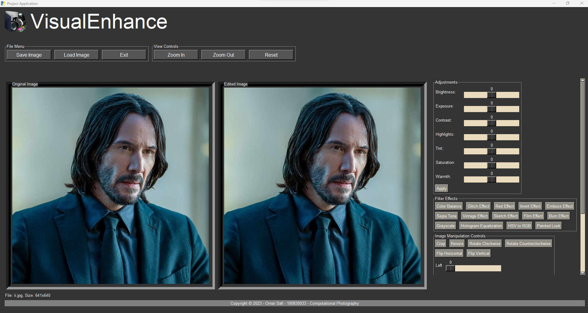
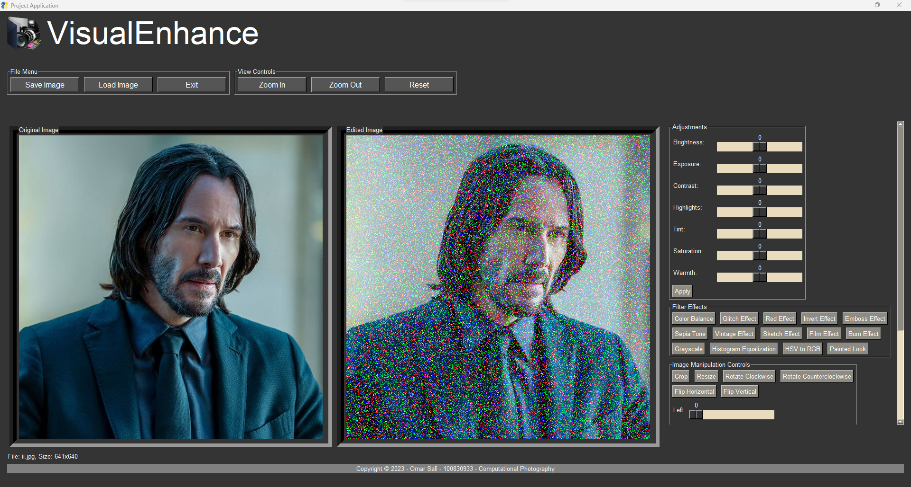

# Final Project - VisualEnhance: Image Enhancement
> Course: CSCI 3240U - Computational Photography 

Project Group: 30

Group Members: Omar Safi

Project Overview:

This is a Python script that utilizes the PySimpleGUI library to construct a graphical user interface (GUI) for executing a range of image processing tasks on a given image. The script encompasses functions for image loading, application of various image effects like glitch effect, vintage effect, sketch effect, modification of image parameters such as brightness, exposure, tint, and the presentation of the processed images within a PySimpleGUI window.

Below are some screenshots: one showcasing the user interface of the application, and another demonstrating the use of the Glitch Effect filter.

Key Features:

Image Filters: Includes options such as glitch, invert, sketch, and more.

Adjustment Sliders: These allow for control over image properties like brightness, exposure, highlights, tints, etc.

Image Manipulation: Provides the ability to crop, resize, rotate, and flip images.

View Controls: Enables zooming in and out, along with a reset button to revert any edits and restore the original image.

File Menu: Facilitates saving and loading images, and includes an exit button to close the application.

GUI Styling: The graphical user interface is designed with various styling elements and themes.

Event Handling: Manages user interactions with the GUI.

PySimpleGUI Library: This library is used to construct a GUI equipped with buttons, sliders, and canvas components for image display.

How to run: 

Clone in github using git bash Go on the repository URL of the assignment. Copy the url and open git on gitbash
and then git clone url link and open the file. Once you open the file, you should install all the required dependencies using pip install. Once thats done, run the program and in the terminal write: python filename.py imagename.jpg or other sourcefile and the application should pop up and now you can Enhance and edit your images.

Dependencies Required:

PySimpleGUI,
opencv-python,
numpy,
matplotlib,
imutils,
pandas,
scipy,
argparse,
threading,
Pillow

Other resources:

I used the class labs for my Final Project.

